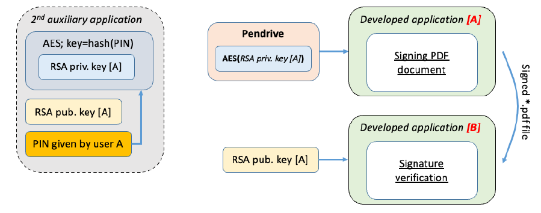

# BSK-project
The main goal of the project is to realize a software tool for emulating the qualified electronic signature, i.e. signing *.pdf documents. It is important to fully emulate the process, including the hardware toll needed for person identification.

# Authors
- Dominika Zaorska
- Karina Wołoszyn

# Used software
PyCharm Community Edition 2024.3.5.
Doxygen version 1.13.2
Doxywizard (Doxygen GUI) with 5.15.2 Qt version

# Tasks
The main task of the project is to design and develop an application to make a qualified electronic signature according to PAdES (PDF Advanced Electronic Signature) standard concept. In general, the application must take a form of a set of tools for realization the qualified electronic signature.

The general concept is pointed out in Fig. 1. 

Additionally to the main application, user has a 2nd auxiliary application for generating a pair of RSA keys and securing the private key. The encrypted private key will be stored on a pendrive and it will be used for signing the document.

## General usage scenario:

The user A has a hardware tool (a pendrive) with encrypted private RSA key. The key is encrypted by AES algorithm using as a key user’s PIN number. 
The PIN is given by the user during generating a pair of RSA keys using an auxiliary application. 
The application for PAdES signature must automatically identify the hardware tool and read the private key to sign the *.pdf document.
Before signing the document, user A must nenter the PIN number to decrypt the private RSA key.
Regarding the concept of PAdES standard, the electronic signature is attached inside *.pdf document. 

The second user B must have a possibility to verify the signature (using the same application), by having the public key of user A and the signed document. 
During the verification user B generates the hash from the document and verifies it with the hash generated by user A (after proper RSA decryption).

